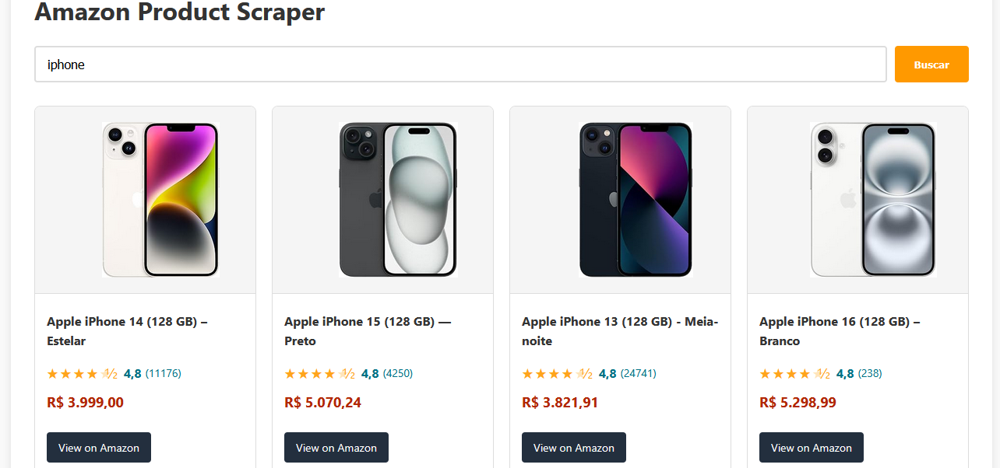

# Amazon Product Scraper with Bun + Vite


A modern web scraper that extracts product data from Amazon Brazil search results using Bun runtime and Vite.

## 📋 Features / Funcionalidades

- Scrapes product titles, ratings, reviews, images and prices / Extrai títulos, avaliações, reviews, imagens e preços
- Simple API endpoint (`/api/scrape`) / Endpoint API simples
- Lightning fast frontend with Vite / Frontend rápido com Vite
- Error handling and validation / Tratamento de erros e validação

## 🛠️ Technologies / Tecnologias

### Backend
- Bun (runtime)
- Axios (HTTP requests / requisições HTTP)
- JSDOM (HTML parsing / análise de HTML)

### Frontend
- Vite (build tool)
- Vanilla JavaScript
- HTML5 + CSS3
## 🚀 Installation / Instalação

1. Clone the repository / Clone o repositório:
```
git clone https://github.com/renanmello/amazon-scraper-bun.git
cd amazon-scraper-bun
```
2. Install backend dependencies / Instale dependências do backend:
```
cd backend
bun install
```
3. Install frontend dependencies / Instale dependências do frontend:
```
cd ../frontend
bun install
```
4. Start the servers / Inicie os servidores:

Terminal 1 (Backend):
```
cd backend
bun run server.ts
```
Terminal 2 (Frontend):
```
cd frontend
bun run dev
```

5. Access in your browser / Acesse no navegador:
```
http://localhost:5173
```
## 📚 Usage
API Endpoint
```
GET /api/scrape?keyword=SEARCH_TERM
```
Example Response / Exemplo de Resposta:
```
[
  {
    "title": "iPhone 14 Pro Max 128GB - Space Black",
    "rating": "4.8",
    "reviews": "3421",
    "image": "https://m.media-amazon.com/images/I/61...jpg",
    "price": "R$ 7.599",
    "link": "https://www.amazon.com.br/iPhone-14-Pro-Max-128GB/dp/..."
  }
]
```

## Frontend Interface
Enter search term (e.g. "Iphone")

Click "Search" button

View formatted results

ScreenShot:



## 🏗️ Project Structure / Estrutura do Projeto
```
amazon-scraper-bun/
├── backend/
│   ├── server.ts         # Backend server
│   └── package.json      # Backend dependencies
├── frontend/
│   ├── src/
│   │   ├── main.ts       # Frontend logic
│   │   └── style.css     # CSS styles
│   ├── index.html        # HTML template
│   └── package.json      # Frontend dependencies
└── README.md             # Documentation
```

## ⚠️  Limitations / Limitações
-Only scrapes first page of results / Extrai apenas a primeira página

-May get blocked if making too many requests / Pode ser bloqueado por muitas requisições

-Educational purpose only / Fins educacionais

## 📄 License / Licença
MIT - See LICENSE for details.

Developed with ❤️ by / Desenvolvido com ❤️ por Renan Mello
